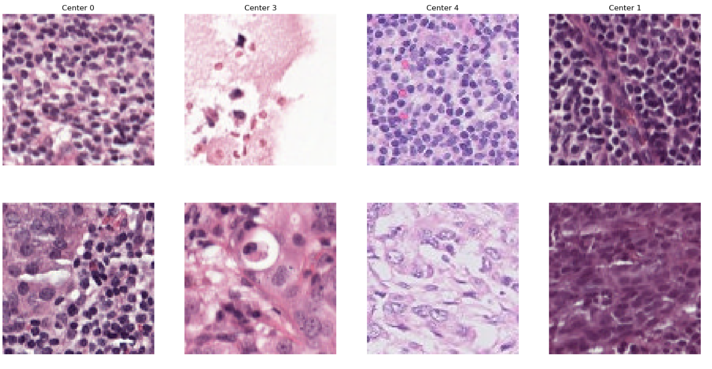

# DLMI Challenge 2025

autors : **Enzo Benbalit and Robenson Mondelice**

## Dasets
The dataset consists of patches of whole slide images which should be classified into either containing tumor or not. The training images come from 3 different centers (i.e. hospitals), while the validation set comes from another center and the test set from yet another center. The visual aspect of the patches are quite different due to the slightly different staining procedures, conditions, and equipment from each hospital. The objective of the task is to build a classifier that is impacted by this distribution shift as little as possible.

## Folder

Because data are huge, we can't store them anywhere. the original `train.h5`, `test.h5` and `val.h5` need to be stored in `data/{...}.h5`. The pre-computed dataset in `data_preparation.ipynb` are stored in `data/precomputed_datasets/{...}.h5`.

- In `data_analysis.ipynb` we perform data analysis and transformation on the training data. 
- In `data_preparation.ipynb` we construct pre-evaluate dataset to reduce training time.
- In `DLMI_main.ipynb` we construct, train and test our models and pipeline with the new training and validation set computed in `data_preparation.ipynb`.

## Models 

Checkpoints of our models are stored in `model/` and can be used by following the `Test forward pass` in the `DLMI_main.ipynb` notebook.
